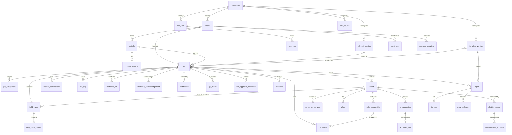

# 06 — Normalised data model and audit model

> Status: **Draft for review** · Owner: Product architecture (with `SECURITY` and `PRIVACY` reviewers for audit, immutability and retention) · Applies to: `apps/api/migrations`, `apps/api/src`, `packages/domain/src/core`, `packages/domain/src/audit`, and the future mobile local store

This section documents the data model **as implemented** in iteration 1 and the audit model that
protects it. The sources of truth are the SQL migrations (`apps/api/migrations/0001_core_schema.sql`,
`0002_immutability.sql`, `0003_counters_and_sync_scope.sql`, `0004_cgt_purpose.sql`) and the code that writes them. Where this document and the migrations
disagree, the migrations win and this document is a defect. Vocabulary follows
`00-architecture-and-conventions.md`. Anything not in code is marked **Planned**. Nothing here is a
claim of compliance with any law or standard.

## 1. Modelling approach

| #   | Decision                                                                                                   | Implementation                                                                                                                                                                                                                                                                 | Rationale                                                                                                                                                                          |
| --- | ---------------------------------------------------------------------------------------------------------- | ------------------------------------------------------------------------------------------------------------------------------------------------------------------------------------------------------------------------------------------------------------------------------ | ---------------------------------------------------------------------------------------------------------------------------------------------------------------------------------- |
| M1  | **Relational core** for identities, ownership, workflow state and anything joined, filtered or constrained | `organisation`, `app_user`, `client`, `portfolio`, `job`, `asset`, issue tables (`report`, `invoice`, `email_delivery`), `audit_event`                                                                                                                                         | FKs, `CHECK` vocabularies (00 §4), unique keys and triggers are enforced by PostgreSQL, not only by the API                                                                        |
| M2  | **Versioned JSONB documents** for configuration                                                            | `rule_set_version.content`, `template_version.content` (sections, clause versions, specialist reviews), each with `content_hash` (SHA-256 of canonical JSON)                                                                                                                   | Rule sets and templates are authored, reviewed and approved as whole versions (G4); a job pins the exact version it used                                                           |
| M3  | **JSONB documents for nested evidence**, with a few promoted columns for keys and filters                  | `sale_comparable.data`, `rental_comparable.data`, `calculation.record`, `market_commentary.data`, `risk_flag.data`, `photo.data`, `ai_suggestion.data`, `accepted_fact.data`, `sketch_version.data`, `certification.data`, `qa_review.data`, `invoice.data`, `report.snapshot` | The domain types in `@vp/domain` are the schema; the same document shape is used offline, in validation and in snapshots, so hashing is stable                                     |
| M4  | **Configuration-driven field values** instead of a column per requirement                                  | `field_value` (current value per job/asset/field id) + `field_value_history` (every version); field ids from the field catalogue (`generated/field-catalogue.md`, 189 fields)                                                                                                  | Purpose × property type × scope × jurisdiction changes required fields without migrations (ADR-005); changing the selection never deletes data (brief §10)                         |
| M5  | **Provenance on every captured datum**                                                                     | `field_value.provenance` and embedded `provenance` in comparables, commentary sources and accepted facts (`Provenance` in `core/provenance.ts`)                                                                                                                                | Brief §1: source, retrieval time, effective date, licence basis, verification status (G3)                                                                                          |
| M6  | **Multi-tenant by `org_id`**                                                                               | Every tenant-owned table carries `org_id` (FK `organisation`), except link/child tables listed in §3.9 that inherit tenancy from their parent                                                                                                                                  | Tenant isolation is enforced in the API today; PostgreSQL row-level security is **Planned** (S-091) `[REVIEW: SECURITY]`                                                           |
| M7  | **Client-generated identifiers**                                                                           | UUID primary keys accepted from clients for assets, photos, comparables, risk flags and sketch boundaries                                                                                                                                                                      | Offline creation and idempotent replay (ADR-004)                                                                                                                                   |
| M8  | **Types**                                                                                                  | Calendar dates `date` (`as_at_date`, `effective_from`); instants `timestamptz` (UTC); money **integer cents** in columns (`fee_cents`, `subtotal_cents`, `gst_cents`, `total_cents`)                                                                                           | 00 §3. Gap: money **inside JSONB** (sale `price`, rental `faceRentPa`, certification `amount.value`, `money` field values) is held in dollars as the domain uses it (A-06); see §9 |
| M9  | **Immutable snapshots** for certification, QA and issue                                                    | Content hash (§6.1) bound to certification, submission, review and approval; full `issue-snapshot@1` stored on `report`                                                                                                                                                        | Brief §10: issued PDF, invoice and email records reproducible from an immutable audit snapshot                                                                                     |

Why not one table per brief entity? (a) requirements are configuration, so most "entities" in
brief §9 are groups of fields that vary by selection; (b) offline sync needs whole-document merge
with per-field versions; (c) snapshots and hashes need a canonical document form. Entities that
need their own lifecycle, query patterns or constraints are promoted to tables (§2, "normalisation
candidates").

## 2. Brief §9 entity mapping

Status: **Implemented** (table or document with API write path), **Partial** (stored, but as
free-form field values, no dedicated lifecycle, or no API), **Planned** (not in code).

| Brief entity         | Where it lives today                                                                                                                                                                     | Status                            | Notes / normalisation candidate                                                                                                |
| -------------------- | ---------------------------------------------------------------------------------------------------------------------------------------------------------------------------------------- | --------------------------------- | ------------------------------------------------------------------------------------------------------------------------------ |
| Organisation         | `organisation`                                                                                                                                                                           | Partial                           | Schema only; created by seed. Admin API **Planned** (`org.manage` is granted but unused)                                       |
| User                 | `app_user` (`idp_subject`, `status`, `credentials` JSONB)                                                                                                                                | Partial                           | No user-management API (`user.manage` unused); provisioning via IdP/seed                                                       |
| Role                 | `user_role` (role `CHECK` list = 00 §5); grants in code (`auth/permissions.ts`)                                                                                                          | Implemented                       | Permission matrix generated (`generated/permission-matrix.md`)                                                                 |
| Client               | `client`, `client_user` (client-portal scope), `approved_recipient`                                                                                                                      | Partial                           | Only recipient approval has an API; client CRUD **Planned**                                                                    |
| Job                  | `job`, `job_assignment` (role `inspector`)                                                                                                                                               | Implemented                       | Valuer and reviewer are columns on `job`; inspector assignments are optional (01 D12)                                          |
| Portfolio            | `portfolio` (`restricted` = information barrier), `portfolio_member`                                                                                                                     | Partial                           | Distinct from `job.mode = PORTFOLIO` (many assets in one job). No CRUD API                                                     |
| Asset                | `asset` (`address` JSONB, lat/long, `risk_level`, `version`, `field_versions`, `deleted`)                                                                                                | Implemented                       | Soft delete via sync only                                                                                                      |
| Instruction          | Field values `instruction.*`, `dates.*` (job level); `job.client_id`, `responsible_valuer_id`, `reviewer_id`, `fee_cents`                                                                | Partial                           | Kept as fields by design; engagement documents are field refs or `document` rows                                               |
| PropertyInterest     | Field `instruction.interestValued` (enum), `instruction.ownership` (asset); `interest` string on sales                                                                                   | Partial                           | Candidate: enum shared by subject and comparables                                                                              |
| Address              | `asset.address` JSONB (`formatted` + any keys), `latitude`/`longitude`/`geocode_confidence`; field `location.address` with provenance                                                    | Partial                           | Structured, validated address and geocoder provenance **Planned** (S-039)                                                      |
| Parcel               | Field `location.titleReference` (text); `land.*` fields                                                                                                                                  | Partial                           | **Planned** `parcel` table (lot/plan/volume-folio as in `PlanningLookupRequest.parcel`) with provenance, one-to-many per asset |
| PlanningControl      | Fields `planning.zone`, `.overlays`, `.instrument`, `.permissibleUses`, `.prohibitedUses`, `.source`, `.reportDocument`, `.useCompliance`; domain contract `PlanningControlResult`       | Partial                           | **Planned** `planning_control` rows per zone/overlay with per-control provenance (04 §2)                                       |
| Hazard               | Field `land.environmental` (long text); `risk_flag` category `environmental`; `DataSourceKind` `hazard`                                                                                  | Planned                           | **Planned** `hazard` table (type, layer, source, effective date, verification)                                                 |
| Inspection           | `job.scope`, fields `dates.inspection`, `scope.*`; photos carry `capturedAt`/`capturedBy`                                                                                                | Planned                           | **Planned** `inspection` record (inspector, start/end, access attempts, device)                                                |
| Area/Room            | `photo.data.roomOrArea` (string); boundary `label`/`level` in sketches                                                                                                                   | Planned                           | **Planned** room/area checklist records (05 M-06)                                                                              |
| Improvement          | Fields `improvements.*` (asset level); `accepted_fact` for human-confirmed AI attributes                                                                                                 | Partial                           | One improvement set per asset; multi-improvement assets **Planned**                                                            |
| MeasurementProject   | Not modelled. Versions grouped by `sketch_version.sketch_id`; field `improvements.areaSchedule` names the reporting sketch                                                               | Planned                           | Decide whether a project wrapper adds value beyond `sketch_id`                                                                 |
| SourcePlan           | `sourcePlanId` referenced by sketch versions, calibrations and AI suggestions; the API requires it to be a `photo` or `document` of the job (`UNKNOWN_SOURCE_PLAN`); no table of its own | Partial                           | Intended as a `document` row (kind `plan`) once upload exists (S-034, S-047); no API writes `document` rows yet                |
| ScaleCalibration     | `sketch_version.data.calibration` (method, points, `metresPerUnit`, `status` unverified/confirmed/superseded, `confirmedBy`)                                                             | Implemented (embedded)            | Superseded calibrations are retained in earlier sketch versions                                                                |
| Sketch               | Logical id `sketch_version.sketch_id`                                                                                                                                                    | Implemented (implicit)            | No parent row                                                                                                                  |
| SketchVersion        | `sketch_version` (`status` working/approved/frozen, `content_hash`)                                                                                                                      | Implemented                       | Guard trigger (§7)                                                                                                             |
| Boundary             | `sketch_version.data.boundaries[]` (points, closed, `dimensionSource`, `origin`, `reviewStatus`, `measuredBy/At`)                                                                        | Implemented (embedded)            |                                                                                                                                |
| AreaComponent        | Boundary with `role = component`, `componentType`                                                                                                                                        | Implemented (embedded)            |                                                                                                                                |
| AreaDeduction        | Boundary with `role = deduction`                                                                                                                                                         | Implemented (embedded)            |                                                                                                                                |
| AreaSchedule         | Computed by `computeAreaSchedule()` on read; persisted copy in `measurement_approval.schedule` with `schedule_hash`                                                                      | Implemented (computed + snapshot) |                                                                                                                                |
| MeasurementApproval  | `measurement_approval`                                                                                                                                                                   | Implemented                       | Append-only                                                                                                                    |
| Photo                | `photo` (metadata, `sha256`, privacy status in `data`)                                                                                                                                   | Partial                           | Binary is **not** stored; object storage and upload **Planned** (S-034)                                                        |
| Document             | `document` (`sha256`, `size_bytes`, `storage_key`)                                                                                                                                       | Partial                           | Table exists and is counted for engagement; no API writes it (**Planned**)                                                     |
| DataSource           | `data_source` (PK `(org_id, id)`, `licence` JSONB, `freshness_days`, `status`)                                                                                                           | Partial                           | Seeded; registry API **Planned** (`datasource.manage` unused)                                                                  |
| SaleComparable       | `sale_comparable.data`                                                                                                                                                                   | Implemented                       |                                                                                                                                |
| RentalComparable     | `rental_comparable.data`                                                                                                                                                                 | Implemented                       |                                                                                                                                |
| Adjustment           | `adjustments[]` inside sale/rental `data`                                                                                                                                                | Implemented (embedded)            |                                                                                                                                |
| Lease                | Fields `occupancy.leaseSummary`, `tenancy.schedule` (list), `tenancy.*`, `rent.*`                                                                                                        | Planned                           | **Planned** `lease` table (tenant, area, dates, rent, reviews, options) for tenancy schedule and WALE                          |
| ValuationMethod      | Fields `valuation.approaches`, `.primaryApproach`, `.crossCheckApproach`                                                                                                                 | Partial                           |                                                                                                                                |
| ValuationCalculation | `calculation` (`record` JSONB, `formula_id`/`formula_version`, `trace_hash`, embedded `override`)                                                                                        | Implemented                       |                                                                                                                                |
| MarketCommentary     | `market_commentary` (+ fields `market.*`)                                                                                                                                                | Implemented                       |                                                                                                                                |
| Assumption           | Fields `assumptions.general`, `.special`, `.materialUncertainty`; arrays in `certification.data`                                                                                         | Partial                           | Candidate: assumption records linked to clause versions `[REVIEW: API_STANDARDS]`                                              |
| Limitation           | Field `assumptions.limitations`; `certification.data.limitations`                                                                                                                        | Partial                           | As Assumption                                                                                                                  |
| RiskFlag             | `risk_flag`; `asset.risk_level` derived from open flags                                                                                                                                  | Implemented                       |                                                                                                                                |
| Certification        | `certification`                                                                                                                                                                          | Implemented                       | Append-only                                                                                                                    |
| QAReview             | `qa_review` (`data` holds checklist and findings)                                                                                                                                        | Implemented                       |                                                                                                                                |
| QAFinding            | `qa_review.data.findings[]`                                                                                                                                                              | Implemented (embedded)            | Candidate table for cross-job QA reporting                                                                                     |
| Template             | Logical id `template_version.template_id`                                                                                                                                                | Implemented (implicit)            |                                                                                                                                |
| TemplateVersion      | `template_version` (clause versions embedded)                                                                                                                                            | Implemented                       |                                                                                                                                |
| Report               | `report` (`snapshot`, `pdf` bytea)                                                                                                                                                       | Implemented                       | PDF in database until object storage (S-034)                                                                                   |
| Invoice              | `invoice` (single line, integer cents, `pdf` bytea)                                                                                                                                      | Implemented                       | Credit notes and accounting export **Planned** (S-071)                                                                         |
| EmailDelivery        | `email_delivery`                                                                                                                                                                         | Implemented                       |                                                                                                                                |
| AuditEvent           | `audit_event`                                                                                                                                                                            | Implemented                       | §5                                                                                                                             |

Tables with no brief §9 counterpart: `rule_set_version`, `field_value`, `field_value_history`,
`approved_recipient`, `ai_suggestion`, `accepted_fact`, `validation_run`,
`validation_acknowledgement`, `self_approval_exception`, `invoice_counter`, `sync_operation`,
`sync_conflict`, `legal_hold`, `schema_migration`.

## 3. Table-by-table summary

### 3.1 Tenancy, identity and access

| Table                   | Columns of note                                                                                                                                                                                                                                                                                                                                                          | Constraints and indexes                                                                                             |
| ----------------------- | ------------------------------------------------------------------------------------------------------------------------------------------------------------------------------------------------------------------------------------------------------------------------------------------------------------------------------------------------------------------------ | ------------------------------------------------------------------------------------------------------------------- |
| `organisation`          | `name`, `abn` (required before issue: `SUPPLIER_ABN_REQUIRED`)                                                                                                                                                                                                                                                                                                           | PK `id`                                                                                                             |
| `app_user`              | `email`, `display_name`, `idp_subject` (OIDC `sub`), `credentials` JSONB, `status`                                                                                                                                                                                                                                                                                       | `CHECK status ∈ {active, suspended, deleted}`; unique `(org_id, lower(email))`; unique `idp_subject` where not null |
| `user_role`             | `user_id`, `role`                                                                                                                                                                                                                                                                                                                                                        | PK `(user_id, role)`; `CHECK role ∈` the eight roles of 00 §5                                                       |
| `valuer_profile` (0005) | PK `user_id` → `app_user`, `org_id`, `full_name`, `credentials` JSONB, `api_member_number` (Australian Property Institute member number), `registrations` JSONB (`[{ jurisdiction: QLD \| WA, number, expiresOn? }]`), `signature` JSONB (`{ kind: drawn \| typed, value, updatedAt }`; a drawn signature is a PNG data URL of at most 200,000 characters), `updated_at` | One row per valuer; written only by `PUT /v1/me/profile` for the caller's own row (01 D13)                          |
| `client`                | `name`, `abn`                                                                                                                                                                                                                                                                                                                                                            | PK `id`                                                                                                             |
| `client_user`           | `user_id`, `client_id`                                                                                                                                                                                                                                                                                                                                                   | PK `(user_id, client_id)`                                                                                           |
| `approved_recipient`    | `client_id`, `email`, `approved_by/at`, `revoked_at`                                                                                                                                                                                                                                                                                                                     | Partial unique `(client_id, lower(email)) WHERE revoked_at IS NULL`                                                 |
| `portfolio`             | `client_id` (nullable), `restricted`                                                                                                                                                                                                                                                                                                                                     | PK `id`                                                                                                             |
| `portfolio_member`      | `portfolio_id`, `user_id`                                                                                                                                                                                                                                                                                                                                                | PK `(portfolio_id, user_id)`                                                                                        |
| `data_source`           | `id` text, `provider`, `kind`, `jurisdictions text[]`, `licence` JSONB, `freshness_days`                                                                                                                                                                                                                                                                                 | PK `(org_id, id)`; `CHECK status ∈ {active, suspended, retired}`                                                    |

### 3.2 Versioned configuration

| Table              | Columns of note                                                                                                                    | Constraints and indexes                                                                         |
| ------------------ | ---------------------------------------------------------------------------------------------------------------------------------- | ----------------------------------------------------------------------------------------------- |
| `rule_set_version` | `rule_set_id`, `version` text, `status`, `effective_from/to` date, `content`, `content_hash`, `authored_by` text, `approved_by/at` | Unique `(org_id, rule_set_id, version)`; `CHECK status ∈ {draft, in_review, approved, retired}` |
| `template_version` | `template_id`, `version` int, `status`, `content`, `content_hash`, `authored_by`, `approved_by/at`                                 | Unique `(org_id, template_id, version)`; same status `CHECK`                                    |

### 3.3 Jobs, assets and captured values

| Table                 | Columns of note                                                                                                                                                                                                                                                                                        | Constraints and indexes                                                                                                                                                                                                             |
| --------------------- | ------------------------------------------------------------------------------------------------------------------------------------------------------------------------------------------------------------------------------------------------------------------------------------------------------ | ----------------------------------------------------------------------------------------------------------------------------------------------------------------------------------------------------------------------------------- |
| `job`                 | `reference`, `client_id`, `portfolio_id`, `status`, selection columns (`jurisdiction`, `purpose`, `property_type`, `scope`, `mode`), `rule_set_version_id`, `template_version_id`, `responsible_valuer_id`, `reviewer_id`, `fee_cents`, `submitted_snapshot_hash`, `approved_snapshot_hash`, `version` | `CHECK` on status and every selection column (00 §4, §7; migration 0004 renamed purpose `CGT_RETROSPECTIVE` to `CGT` in the constraint and existing rows); `fee_cents >= 0`; unique `(org_id, reference)`; index `(org_id, status)` |
| `job_assignment`      | `job_id`, `user_id`, `role`                                                                                                                                                                                                                                                                            | PK `(job_id, user_id, role)`; `CHECK role = 'inspector'`                                                                                                                                                                            |
| `asset`               | `label`, `address` JSONB, `latitude`/`longitude` (range `CHECK`), `geocode_confidence`, `risk_level`, `version`, `field_versions` JSONB, `deleted`                                                                                                                                                     | Index `(job_id)`                                                                                                                                                                                                                    |
| `field_value`         | `job_id`, `asset_id` (null = job level), `field_id`, `value` JSONB, `provenance` JSONB, `version`, `updated_by/at`                                                                                                                                                                                     | Unique `(job_id, coalesce(asset_id, nil-uuid), field_id)`                                                                                                                                                                           |
| `field_value_history` | `field_value_id`, `version`, `value`, `provenance`, `changed_by/at`, `reason`                                                                                                                                                                                                                          | PK `bigserial`; append-only trigger                                                                                                                                                                                                 |
| `document`            | `kind`, `filename`, `sha256`, `size_bytes`, `storage_key`, `uploaded_by/at`                                                                                                                                                                                                                            | `job_id` nullable                                                                                                                                                                                                                   |

### 3.4 Evidence and analysis

| Table                                   | Columns of note                                                                                                                                                       | Constraints and indexes                     |
| --------------------------------------- | --------------------------------------------------------------------------------------------------------------------------------------------------------------------- | ------------------------------------------- |
| `sale_comparable` / `rental_comparable` | `asset_id`, `data` (comparable incl. `provenance`, `adjustments[]`), `created_by/at`                                                                                  | FK `asset`                                  |
| `calculation`                           | `id` **text** (sale-derived calculations use `<saleId>:land_rate`, `:building_rate`, `:adjusted`), `sale_id`, `formula_id`, `formula_version`, `record`, `trace_hash` | Index `(job_id)`                            |
| `market_commentary`                     | `level`, `as_at_date` date, `data` (text, author, `sources[]` provenance)                                                                                             | `CHECK level ∈ {national, state, local}`    |
| `risk_flag`                             | `status`, `data` (category, severity, escalation, resolution note)                                                                                                    | `CHECK status ∈ {open, resolved, accepted}` |

### 3.5 Inspection, photos and AI

| Table           | Columns of note                                                                                                                                                                   | Constraints and indexes                                                        |
| --------------- | --------------------------------------------------------------------------------------------------------------------------------------------------------------------------------- | ------------------------------------------------------------------------------ |
| `photo`         | `asset_id`, `sha256`, `data` (`PhotoRecord`: sequence, capture time, GPS, caption, privacy flags/status, redaction/consent refs, quality), `version`, `field_versions`, `deleted` | Partial unique `(asset_id, sha256) WHERE NOT deleted` (offline de-duplication) |
| `ai_suggestion` | `status`, `data` (kind, label, value, confidence, model ref, decision)                                                                                                            | `CHECK status ∈ {pending, accepted, edited, rejected}`                         |
| `accepted_fact` | `suggestion_id`, `data` (fact with provenance `ai_suggestion_accepted`/`_edited`)                                                                                                 | FK `ai_suggestion`                                                             |

### 3.6 Areas and sketches

| Table                  | Columns of note                                                                                                        | Constraints and indexes                                                                    |
| ---------------------- | ---------------------------------------------------------------------------------------------------------------------- | ------------------------------------------------------------------------------------------ |
| `sketch_version`       | `sketch_id`, `version`, `status`, `data` (`SketchVersion`), `content_hash` (canonical hash of `data` without `status`) | Unique `(sketch_id, version)`; `CHECK status ∈ {working, approved, frozen}`; guard trigger |
| `measurement_approval` | `sketch_version_id`, `schedule` JSONB, `schedule_hash`, `approved_by/at`                                               | Append-only trigger                                                                        |

### 3.7 Validation, certification and QA

| Table                        | Columns of note                                                                                                               | Constraints and indexes                                                                                                                                                  |
| ---------------------------- | ----------------------------------------------------------------------------------------------------------------------------- | ------------------------------------------------------------------------------------------------------------------------------------------------------------------------ |
| `validation_run`             | `stage`, `result` JSONB, `ran_by/at`                                                                                          | Insert-only by the API                                                                                                                                                   |
| `validation_acknowledgement` | `code`, `path`, `reason`, `ack_by/at`                                                                                         | Unique `(job_id, code, path)` (re-acknowledging replaces reason)                                                                                                         |
| `certification`              | `data` (`Certification`), `snapshot_hash`, `signed_by/at`                                                                     | Append-only trigger                                                                                                                                                      |
| `valuer_signature` (0005)    | `user_id`, `sha256` (`signatureHash` of kind and value), `org_id`, `kind`, `value` (PNG data URL or typed name), `created_at` | PK `(user_id, sha256)`; append-only trigger. Written when a certification is signed, so the report always shows the signature used then, whatever the profile says later |
| `qa_review`                  | `reviewer_id`, `reviewed_snapshot_hash`, `outcome`, `data` (checklist, findings, exception), `started_at`, `completed_at`     | `CHECK outcome ∈ {approved, returned}`                                                                                                                                   |
| `self_approval_exception`    | `authorised_by`, `reason`, `authorised_at`                                                                                    | Insert-only by the API                                                                                                                                                   |

### 3.8 Issue

| Table                    | Columns of note                                                                                                                         | Constraints and indexes                                                                                               |
| ------------------------ | --------------------------------------------------------------------------------------------------------------------------------------- | --------------------------------------------------------------------------------------------------------------------- |
| `report`                 | `version`, `status`, `snapshot` (`issue-snapshot@1`), `snapshot_hash`, `pdf` bytea, `pdf_sha256`, `template_version_id`, `issued_by/at` | Unique `(job_id, version)`; `CHECK status ∈ {issued, superseded}`; guard trigger                                      |
| `invoice`                | `report_id`, `number` (`INV-YYYY-NNNNN`), `data`, `subtotal/gst/total_cents`, `pdf`, `pdf_sha256`                                       | Unique `(org_id, number)`; append-only trigger                                                                        |
| `invoice_counter` (0003) | `org_id`, `year`, `last_number`                                                                                                         | PK `(org_id, year)`; incremented atomically in the issue transaction (`INSERT … ON CONFLICT … DO UPDATE … RETURNING`) |
| `email_delivery`         | `report_id`, `recipient`, `payload_hash`, `status`, `provider_message_id`, `attempts`                                                   | `CHECK status ∈ {queued, sent, delivered, bounced, failed}`                                                           |

### 3.9 Audit, sync and retention

| Table              | Columns of note                                                                                                                                      | Constraints and indexes                                                          |
| ------------------ | ---------------------------------------------------------------------------------------------------------------------------------------------------- | -------------------------------------------------------------------------------- |
| `audit_event`      | `stream_id`, `seq`, `at`, `event` JSONB (hashed source of truth), denormalised `action`, `entity_type`, `entity_id`, `actor_id`, `prev_hash`, `hash` | Unique `(stream_id, seq)`; index `(entity_type, entity_id)`; append-only trigger |
| `sync_operation`   | `op_id` text, `device_id`, `user_id`, `entity_type/id`, `outcome`, `received_at`                                                                     | PK `(org_id, device_id, op_id)` (0003; was a global `op_id`)                     |
| `sync_conflict`    | `op_id`, `entity_type/id`, `conflicts` JSONB, `status`                                                                                               | `CHECK status ∈ {open, resolved}`                                                |
| `legal_hold`       | `scope_type` (job/client/portfolio), `scope_id`, `reason`, `applied_by/at`, `released_by/at`                                                         | Polymorphic scope (no FK)                                                        |
| `schema_migration` | `version`, `name`, `checksum`, `applied_at`                                                                                                          | Created by the migrator (§8)                                                     |

Tables without `org_id` (tenancy via parent FK): `user_role`, `client_user`, `portfolio_member`,
`job_assignment`, `field_value_history`, `schema_migration`.

### 3.10 Relationship overview



`audit_event`, `legal_hold`, `sync_operation` and `sync_conflict` reference entities
polymorphically (`entity_type`/`entity_id`, `scope_type`/`scope_id`) and are omitted.

## 4. Record metadata standard (brief §9)

Brief §9 asks every material record to support status, owner, created/modified identity and time,
source, effective date, verification state, confidence where machine-generated, and immutable
history after issue. `RecordMeta` in `core/provenance.ts` defines the target shape; it is not yet
applied uniformly.

| Record class                                 | Status                    | Created (who, when)                           | Modified (who, when)                                                          | Source / provenance                                                           | Effective date                                                | Verification                               | Confidence                | Immutable after issue                                                                               |
| -------------------------------------------- | ------------------------- | --------------------------------------------- | ----------------------------------------------------------------------------- | ----------------------------------------------------------------------------- | ------------------------------------------------------------- | ------------------------------------------ | ------------------------- | --------------------------------------------------------------------------------------------------- |
| Job                                          | `status`                  | `created_by`, `created_at`                    | `updated_at` only (actor in audit)                                            | n/a                                                                           | `dates.valuation` field                                       | n/a                                        | n/a                       | Locked outside `draft/active/returned` (`assertEditable`); amendment re-opens, issued `report` kept |
| Asset                                        | `deleted` only            | `created_by`, `created_at`                    | `updated_at` only                                                             | `location.address` field provenance; `asset.address` has none                 | n/a                                                           | via field provenance                       | `geocode_confidence`      | Status lock; sync rejects when locked                                                               |
| Field value                                  | n/a                       | `field_value_history` v1                      | `updated_by`, `updated_at` + full history                                     | `provenance` (origin, `sourceId`, `sourceRef`, `retrievedAt`, `licenceBasis`) | `provenance.effectiveDate`                                    | `provenance.verification`, `verifiedBy/At` | `provenance.confidence`   | Status lock; history append-only (trigger)                                                          |
| Sale / rental comparable                     | n/a                       | `created_by`, `created_at`                    | No update path                                                                | `data.provenance`                                                             | `contractDate` / `leaseStartDate`; provenance `effectiveDate` | `data.provenance.verification`             | n/a                       | Status lock (no trigger)                                                                            |
| Calculation                                  | `override` present or not | `computedBy/At` in `record`                   | `override.by/at/reason` (in-place `UPDATE`)                                   | inputs carry `sourceRef`; `formulaId@version`; `traceHash`                    | n/a                                                           | n/a                                        | n/a                       | Status lock (no trigger)                                                                            |
| Market commentary                            | n/a                       | `data.authoredBy/At`                          | No update path                                                                | `data.sources[]` provenance                                                   | `as_at_date`                                                  | per source                                 | n/a                       | Status lock                                                                                         |
| Risk flag                                    | `status`                  | none (gap)                                    | none (upsert overwrites; audit only)                                          | n/a                                                                           | n/a                                                           | n/a                                        | n/a                       | Status lock                                                                                         |
| Photo                                        | `data.privacyStatus`      | `capturedBy`, `capturedAt`, `created_at`      | `version` + audit                                                             | `sha256`, optional GPS                                                        | `capturedAt`                                                  | n/a                                        | quality flags             | Status lock                                                                                         |
| AI suggestion / accepted fact                | `status`                  | `createdAt`, model ref                        | `decision.actor/at`                                                           | photo / source plan id, model version                                         | n/a                                                           | human decision                             | `confidence`              | Status lock                                                                                         |
| Sketch version                               | `status`                  | `created_by`, `created_at`                    | new version per change                                                        | boundary `dimensionSource`, `origin`; calibration                             | n/a                                                           | calibration `status`, `confirmedBy`        | schedule row `confidence` | Trigger: approved → frozen only; frozen at issue                                                    |
| Measurement approval, certification, invoice | n/a                       | `approved_by/at`, `signed_by/at`, `issued_at` | never                                                                         | schedule / snapshot hash                                                      | n/a                                                           | n/a                                        | n/a                       | Append-only triggers                                                                                |
| QA review                                    | `outcome`                 | `reviewer_id`, `started_at`                   | `completed_at`; findings carry `raisedBy/At`, `respondedBy/At`, `closedBy/At` | n/a                                                                           | n/a                                                           | n/a                                        | n/a                       | No trigger (gap)                                                                                    |
| Rule set / template version                  | `status`                  | `authored_by`, `created_at` (template)        | `approved_by/at`; template reviews in `content`                               | `content_hash`                                                                | `effective_from/to`                                           | specialist reviews                         | n/a                       | App check only (gap)                                                                                |
| Report / email delivery                      | `status`                  | `issued_by/at`; `created_at`                  | `superseded`; delivery `updated_at`, `attempts`                               | `snapshot_hash`, `pdf_sha256`, `payload_hash`                                 | `issueDate` in snapshot                                       | n/a                                        | n/a                       | Report trigger; delivery mutable by design                                                          |
| Audit event                                  | n/a                       | `actor`, `at`                                 | never                                                                         | n/a                                                                           | n/a                                                           | hash chain                                 | n/a                       | Append-only trigger                                                                                 |

Gaps: no uniform `updated_by` column; `risk_flag` and `market_commentary` lack created columns;
verification and confidence exist only where `Provenance` is embedded; "immutable after issue" is
enforced by the job status lock for most job content and by triggers only for the subset in §7.

## 5. Audit model

### 5.1 Event structure

| Field                                   | Meaning                                                                |
| --------------------------------------- | ---------------------------------------------------------------------- |
| `id`                                    | UUID                                                                   |
| `orgId`, `streamId`                     | Tenant and chain: `job:<jobId>` or `org:<orgId>`                       |
| `seq`                                   | 1-based position in the stream                                         |
| `at`                                    | Server instant (UTC) from the application clock                        |
| `actor`                                 | `{ userId, kind: human \| system \| ai, roles[] }`                     |
| `action`                                | `<entity>.<past_tense_verb>`, validated against `^[a-z_]+\.[a-z_]+$`   |
| `entityType`, `entityId`                | Target record                                                          |
| `reason`, `before`, `after`, `metadata` | Optional JSON; omitted keys are absent, not null                       |
| `prevHash`                              | Hash of the previous event; first event uses `GENESIS_HASH` (64 × `0`) |
| `hash`                                  | `SHA-256(canonicalJson(event without hash))`, lower-case hex           |

Canonical JSON (`core/canonical-json.ts`, `CANONICAL_JSON_VERSION = 1`): object keys sorted,
no whitespace, `undefined` properties omitted, `-0` → `0`, `Date` → ISO string; non-finite numbers,
`undefined` array items, functions, symbols and bigints are rejected. Changing this function
invalidates every stored hash, so a change needs a new version with the old one kept for
verification.

### 5.2 Write path

1. `services/audit.ts#audit()` runs **inside the caller's transaction**, so the change and its
   event commit or roll back together.
2. `pg_advisory_xact_lock(hashtext(streamId))` serialises writers per stream (a hash collision only
   serialises two unrelated streams).
3. The latest event of the stream is read, `appendAuditEvent()` assigns `seq`/`prevHash`/`hash`.
4. The input is JSON round-tripped first, so the hashed object equals what JSONB stores.
5. Insert; unique `(stream_id, seq)` is the backstop if serialisation ever fails.

Exception: `auth.denied` is written by the error handler in a **separate** transaction after the
request's transaction has rolled back (`repo/jobs.ts#recordDenial`). It covers every
`AuthorizationDenied`: denials from `authorize()`, route-level 403s raised with `denied()` (including
the router's actor guard, 07 §2.3) and the hidden 404s for other organisations and restricted
portfolios, whose event records the real code (`WRONG_ORGANISATION`, `RESTRICTED_PORTFOLIO`).

### 5.3 Verification

`verifyAuditChain()` checks sequence continuity, single-stream membership, back-links and recomputes
each hash; it returns `{ valid, count, headHash }` or `{ valid: false, brokenAtSeq, reason }`.
Exposed at `GET /v1/jobs/{jobId}/audit/verify` (`audit.read`) and, for the org stream, inside
`GET /v1/admin/security-events` (administrators; returns the last 200 events).

Limits `[REVIEW: SECURITY]`: a chain detects editing, deletion or re-ordering of stored events but
not truncation of the tail or wholesale re-chaining by a database superuser. Chain-head anchoring
to object-lock storage in a separate account and daily verification are **Planned** (11 SC-09).

### 5.4 Action vocabulary emitted by the code

Stream `job:<id>` unless marked **org**. Sources: `action:` literals in `apps/api/src`, and
`TRANSITIONS[*].auditAction` in `packages/domain/src/workflow/job-workflow.ts`.

| Action                                             | Entity type                                             | Emitted when                                                                                                                                                                                                                                   | Payload notes                                                                                                                                                                                         |
| -------------------------------------------------- | ------------------------------------------------------- | ---------------------------------------------------------------------------------------------------------------------------------------------------------------------------------------------------------------------------------------------- | ----------------------------------------------------------------------------------------------------------------------------------------------------------------------------------------------------- |
| `job.created`                                      | job                                                     | `POST /v1/jobs`                                                                                                                                                                                                                                | after: reference, selection, rule set, template                                                                                                                                                       |
| `job.selection_changed`                            | job                                                     | `PATCH /v1/jobs/{id}/selection`                                                                                                                                                                                                                | reason; before/after selection; metadata: newly/no-longer required, retained count                                                                                                                    |
| `job.assigned`                                     | job                                                     | `POST /v1/jobs/{id}/assign`                                                                                                                                                                                                                    | after: valuer, reviewer, inspectors                                                                                                                                                                   |
| `job.engagement_accepted`                          | job                                                     | `POST …/engagement/accept` (transition)                                                                                                                                                                                                        | before/after status, snapshot hash                                                                                                                                                                    |
| `job.submitted`                                    | job                                                     | `POST …/submit`                                                                                                                                                                                                                                | as above                                                                                                                                                                                              |
| `job.cancelled`                                    | job                                                     | `POST …/cancel`                                                                                                                                                                                                                                | reason (≥ 10 chars)                                                                                                                                                                                   |
| `job.amendment_opened`                             | job                                                     | `POST …/amend`                                                                                                                                                                                                                                 | reason                                                                                                                                                                                                |
| `asset.created`                                    | asset                                                   | job create; `POST …/assets`                                                                                                                                                                                                                    | label, formatted address                                                                                                                                                                              |
| `field.updated`                                    | field_value                                             | `PUT …/fields`; also implicit writes on job create/assign, asset create (`location.*`) and sketch create with `useForReport: true` (`improvements.areaSchedule`, `.measurementBasis`), job create (`dates.instruction`, `instruction.dueDate`) | before value; after value, field, asset, provenance; reason                                                                                                                                           |
| `evidence.sale_added`                              | sale_comparable                                         | `POST …/sales`                                                                                                                                                                                                                                 | full sale (derived calculations are not audited separately)                                                                                                                                           |
| `evidence.rental_added`                            | rental_comparable                                       | `POST …/rentals`                                                                                                                                                                                                                               | full rental                                                                                                                                                                                           |
| `evidence.commentary_added`                        | market_commentary                                       | `POST …/commentary`                                                                                                                                                                                                                            | level, as-at date                                                                                                                                                                                     |
| `risk.flag_recorded`                               | risk_flag                                               | `POST …/risk-flags` (create or update)                                                                                                                                                                                                         | full flag                                                                                                                                                                                             |
| `calculation.run`                                  | calculation                                             | `POST …/calculations`                                                                                                                                                                                                                          | formula@version, output, trace hash                                                                                                                                                                   |
| `calculation.overridden`                           | calculation                                             | `POST …/calculations/{calcId}/override`                                                                                                                                                                                                        | reason; before/after value                                                                                                                                                                            |
| `sketch.version_created`                           | sketch_version                                          | `POST …/assets/{assetId}/sketches`                                                                                                                                                                                                             | version, change summary, total m², schedule hash                                                                                                                                                      |
| `calibration.created`                              | scale_calibration                                       | sketch create/version with `calibration`                                                                                                                                                                                                       | full calibration                                                                                                                                                                                      |
| `calibration.confirmed`                            | scale_calibration                                       | `POST …/sketch-versions/{id}/confirm-scale` (also creates a version, not separately audited)                                                                                                                                                   | reason; new version id, metres per unit                                                                                                                                                               |
| `measurement.approved`                             | sketch_version                                          | `POST …/sketch-versions/{id}/approve`                                                                                                                                                                                                          | schedule hash, total m², basis                                                                                                                                                                        |
| `photo.captured`                                   | photo                                                   | `POST …/photos` (not on de-duplication)                                                                                                                                                                                                        | sha256, asset                                                                                                                                                                                         |
| `photo.privacy_flagged`                            | photo                                                   | `POST …/photos/{id}/privacy` `action=flag`                                                                                                                                                                                                     | before/after privacy status                                                                                                                                                                           |
| `photo.redacted`                                   | photo                                                   | same endpoint, `action=redact`                                                                                                                                                                                                                 | before/after privacy status, action                                                                                                                                                                   |
| `photo.consent_recorded`                           | photo                                                   | same endpoint, `action=consent`                                                                                                                                                                                                                | before/after privacy status, action                                                                                                                                                                   |
| `photo.excluded`                                   | photo                                                   | same endpoint, `action=exclude`                                                                                                                                                                                                                | before/after privacy status, action                                                                                                                                                                   |
| `ai.suggestion_created`                            | ai_suggestion                                           | `POST …/ai-suggestions` (AI actor)                                                                                                                                                                                                             | label, confidence, model                                                                                                                                                                              |
| `ai.suggestion_accepted` / `_edited` / `_rejected` | ai_suggestion                                           | `POST …/ai-suggestions/{id}/decision`                                                                                                                                                                                                          | label, fact id                                                                                                                                                                                        |
| `validation.run`                                   | job                                                     | `POST …/validate`                                                                                                                                                                                                                              | stage, blocking and warning counts                                                                                                                                                                    |
| `validation.acknowledged`                          | job                                                     | `POST …/acknowledgements`                                                                                                                                                                                                                      | reason; code, path                                                                                                                                                                                    |
| `certification.signed`                             | certification                                           | `POST …/certification`                                                                                                                                                                                                                         | snapshot hash, amount, attestation hash, signature fingerprint (`signatureSha256`), state registration printed (QLD/WA)                                                                               |
| `qa.self_approval_exception_authorised`            | job                                                     | `POST …/qa/self-approval-exception`                                                                                                                                                                                                            | reason                                                                                                                                                                                                |
| `qa.started`                                       | job                                                     | `POST …/qa/start` (transition)                                                                                                                                                                                                                 | status, snapshot hash                                                                                                                                                                                 |
| `qa.checklist_answered`                            | qa_review                                               | `POST …/qa/checklist`                                                                                                                                                                                                                          | item, response, note                                                                                                                                                                                  |
| `qa.finding_raised` / `_responded` / `_closed`     | qa_review                                               | `POST …/qa/findings`, `…/{findingId}/respond`, `…/close`                                                                                                                                                                                       | request body                                                                                                                                                                                          |
| `qa.returned` / `qa.approved`                      | job                                                     | `POST …/qa/return`, `…/qa/approve` (transitions)                                                                                                                                                                                               | status, snapshot hash                                                                                                                                                                                 |
| `report.draft_generated`                           | job                                                     | `GET …/report/draft.pdf`                                                                                                                                                                                                                       | PDF sha256                                                                                                                                                                                            |
| `report.issued`                                    | report                                                  | `POST …/issue` (transition)                                                                                                                                                                                                                    | version, snapshot hash, content hash, PDF sha256                                                                                                                                                      |
| `invoice.created`                                  | invoice                                                 | `POST …/issue`                                                                                                                                                                                                                                 | number, total cents, PDF sha256                                                                                                                                                                       |
| `email.queued`                                     | email_delivery                                          | `POST …/issue`, per recipient                                                                                                                                                                                                                  | recipient, payload hash                                                                                                                                                                               |
| `email.sent`                                       | email_delivery                                          | after issue commit, per successful send                                                                                                                                                                                                        | status, recipient                                                                                                                                                                                     |
| `email.delivery_updated`                           | email_delivery                                          | send failure after issue; `POST /v1/email-deliveries/{id}/status`                                                                                                                                                                              | before/after status                                                                                                                                                                                   |
| `report.accessed`                                  | report                                                  | `GET /v1/reports/{id}/pdf`                                                                                                                                                                                                                     | —                                                                                                                                                                                                     |
| `sync.operation_applied`                           | asset / photo                                           | `POST /v1/sync`, outcomes `applied`, `merged`, `deduplicated`                                                                                                                                                                                  | op id, device, outcome                                                                                                                                                                                |
| `sync.conflict_detected`                           | asset / photo                                           | `POST /v1/sync`, outcome `conflict`                                                                                                                                                                                                            | op id, device                                                                                                                                                                                         |
| `template.version_created` (**org**)               | template_version                                        | `POST /v1/admin/templates`                                                                                                                                                                                                                     | template id, version                                                                                                                                                                                  |
| `template.review_recorded` (**org**)               | template_version                                        | `POST …/versions/{v}/reviews`                                                                                                                                                                                                                  | reviewer role, outcome                                                                                                                                                                                |
| `template.version_approved` (**org**)              | template_version                                        | `POST …/versions/{v}/approve`                                                                                                                                                                                                                  | template id, version                                                                                                                                                                                  |
| `ruleset.version_approved` (**org**)               | rule_set_version                                        | `POST /v1/admin/rulesets/…/approve`                                                                                                                                                                                                            | reason (notes)                                                                                                                                                                                        |
| `recipient.approved` (**org**)                     | approved_recipient                                      | `POST /v1/admin/clients/{id}/recipients`                                                                                                                                                                                                       | client, email                                                                                                                                                                                         |
| `legal_hold.applied` (**org**)                     | job / client / portfolio                                | `POST /v1/admin/legal-holds`                                                                                                                                                                                                                   | reason                                                                                                                                                                                                |
| `profile.updated` (**org**)                        | valuer_profile                                          | `PUT /v1/me/profile`                                                                                                                                                                                                                           | before (when a profile was saved before) and after: full name, credentials, API member number, registrations, signature kind and sha256. The signature image itself is never put in the audit payload |
| `auth.denied` (**org**)                            | target entity (`job`, `route`, `org`, `email_delivery`) | any `AuthorizationDenied`: 403 from `authorize()`, route-level 403s (`ACTOR_NOT_PERMITTED`, `NOT_REVIEWER`, `NOT_RESPONSIBLE_VALUER`, `SEPARATION_OF_DUTIES`, `ADMIN_ONLY`, …) and hidden 404s (§5.2)                                          | permission, denial code (the real code for hidden 404s)                                                                                                                                               |

**Not yet emitted** (listed in 00 §8 as initial or planned vocabulary): `asset.updated` (sync
asset updates and deletes emit `sync.operation_applied` instead), `datasource.used`,
`legal_hold.released`, `sync.conflict_resolved`, `ruleset.version_created`,
`user.membership_changed`, `datasource.lookup_failed`, `datasource.fallback_task_created`,
`datasource.verified`, `datasource.config_changed`, `retention.*`, `incident.*`. Reads that are
**not** audited: report metadata, invoice PDF download, reproduction, audit stream reads.

## 6. Snapshots

### 6.1 Content snapshot (`contentSnapshot()` in `services/aggregate.ts`)

The hash of this object (`snapshotHashOf`) is what is certified, submitted, reviewed, approved and
issued. Workflow metadata is excluded so the hash changes only when substantive content changes.

| Included                                                                                                                        | Excluded (and why)                                                                                                                                                                                                     |
| ------------------------------------------------------------------------------------------------------------------------------- | ---------------------------------------------------------------------------------------------------------------------------------------------------------------------------------------------------------------------- |
| Job: id, reference, client, portfolio, selection, `ruleSet` as `id@version`, template version id, responsible valuer, fee cents | Job `status`, `version`, timestamps, submitted/approved hashes (workflow state); `reviewer_id` (a workflow assignment that QA start overwrites with the conducting reviewer; removed from the snapshot in iteration 1) |
| Assets: id, label, address, lat/long                                                                                            | `risk_level`, asset `version` (derived / sync counters)                                                                                                                                                                |
| Field values: field id, asset id, value, provenance                                                                             | Field `version` (history is in `field_value_history`)                                                                                                                                                                  |
| Sales, rentals, calculations (incl. overrides), commentary, risk flags, photos (non-deleted), AI suggestions, accepted facts    | Deleted photos and assets                                                                                                                                                                                              |
| Reporting sketch versions (latest version of the sketch named by `improvements.areaSchedule`) **without `status`**              | Other sketch versions; `status` (approve/freeze must not change the hash)                                                                                                                                              |
| Measurement approvals: sketch version id, schedule hash, approver                                                               | Approval id and time                                                                                                                                                                                                   |
| Validation acknowledgements: code, path, reason, by                                                                             | Acknowledgement time; validation runs                                                                                                                                                                                  |
| —                                                                                                                               | Certification, QA review, self-approval exceptions (they bind _to_ the hash); audit events; data-source registry; rule-set and template content (pinned by id)                                                         |

### 6.2 Binding to workflow

| Step          | Hash recorded                                                             | Checked by                                                                           |
| ------------- | ------------------------------------------------------------------------- | ------------------------------------------------------------------------------------ |
| Certification | `certification.snapshot_hash`                                             | `submitForQa`, `approve`, `issue`: "content changed after certification; re-certify" |
| Submit        | `job.submitted_snapshot_hash`                                             | `POST …/qa/start` recomputes the content hash: `409 SNAPSHOT_MISMATCH` if it differs |
| QA start      | `qa_review.reviewed_snapshot_hash`                                        | `approve`: "content changed during review"                                           |
| QA approve    | `job.approved_snapshot_hash`                                              | `issue`: "content changed after QA approval"                                         |
| Issue         | `report.snapshot.contentHash` and audit `report.issued.after.contentHash` | Reproduction (§6.4)                                                                  |

### 6.3 Issue snapshot (`issue-snapshot@1`, stored in `report.snapshot`)

| Key                     | Contents                                                                                                                                                                                                                                                                                                                                                                                                                                                                                                                      |
| ----------------------- | ----------------------------------------------------------------------------------------------------------------------------------------------------------------------------------------------------------------------------------------------------------------------------------------------------------------------------------------------------------------------------------------------------------------------------------------------------------------------------------------------------------------------------- |
| `schema`                | `"issue-snapshot@1"`                                                                                                                                                                                                                                                                                                                                                                                                                                                                                                          |
| `renderer`              | `RENDERER_VERSION` (currently `pdf-renderer@3`)                                                                                                                                                                                                                                                                                                                                                                                                                                                                               |
| `issuedAt`, `issueDate` | Issue instant; calendar date in the property's jurisdiction time zone                                                                                                                                                                                                                                                                                                                                                                                                                                                         |
| `contentHash`           | Content snapshot hash at issue (= approved hash)                                                                                                                                                                                                                                                                                                                                                                                                                                                                              |
| `reportData`            | `ReportData`: report id/version/status `final`/issue date, firm name, job (id, reference, selection, client name), valuer name, resolved requirements, all field values, assets, sales and analyses, rentals, calculations, area schedules, reporting sketches, **report-eligible photos only** (`includeInReport`; privacy `clear`, `consent_recorded`, or `redacted` with a derivative; blurry/low-light only with an override reason), certification, `userNames` (people the report refers to, see below), `snapshotHash` |
| `template`              | Full approved `TemplateVersion` as used                                                                                                                                                                                                                                                                                                                                                                                                                                                                                       |
| `renderAssets`          | Accepted closed boundaries per sketch version with scale, north bearing and scale status; photo sha256 and captions; map points; `signatures` — the certifying valuer's signature keyed by its sha256 (`{ kind, value }`, the PNG data URL or typed name copied from `valuer_signature`), so reproduction never depends on the current profile (from `pdf-renderer@3`)                                                                                                                                                        |
| `invoice`               | `InvoiceData` (number, issue date, supplier with ABN (required at issue), bill-to with ABN when recorded, lines, cents, GST rate)                                                                                                                                                                                                                                                                                                                                                                                             |
| `emails[]`              | to, from, subject, text, attachments (filename, content type, sha256)                                                                                                                                                                                                                                                                                                                                                                                                                                                         |

`report.snapshot_hash = hashCanonical(snapshot)`. Inputs are JSON round-tripped before rendering
so the stored snapshot is exactly what was rendered. `userNames` holds only the people the report
refers to: the responsible valuer, the reviewer, the certifying valuer, users named in `user_ref`
field values and the measurers of reporting-sketch boundaries (fixed in iteration 1; it previously
copied every user of the organisation) `[REVIEW: PRIVACY]`. Photo bytes are not embedded (photos are
referenced by sha256 until object storage exists).

### 6.4 Reproduce procedure (`POST /v1/reports/{reportId}/reproduce`)

Requires `job.read` on the report's job (after the report-access check), so client users cannot
run it.

1. Load `report.snapshot`, `snapshot_hash`, `pdf_sha256`; `snapshotIntact = hashCanonical(snapshot) == snapshot_hash`.
2. `renderer = { snapshot: snapshot.renderer, current: RENDERER_VERSION, match }`.
3. Re-render `renderReportPdf(composeReport(reportData, template), renderAssets, issuedAt)` with the current renderer; compare SHA-256 with `pdf_sha256`.
4. Re-render `renderInvoicePdf(invoice, issuedAt)`; compare with `invoice.pdf_sha256`.
5. For each `email_delivery` row, recompute `emailPayloadHash` from the matching `emails[]` entry; compare with `payload_hash`.
6. `reproducible = snapshotIntact ∧ renderer.match ∧ pdf.match ∧ invoice.match ∧ every email match`.

Determinism relies on fixed PDF metadata (creation/modification date = `issuedAt`), standard
fonts, and a pinned renderer. Gaps: the stored `pdf` bytes are not re-hashed against
`pdf_sha256`; only the current renderer is runnable, so after a renderer bump every report issued
under an earlier version reports `renderer.match: false` and `reproducible: false` (the mismatch is
explicit, but the old bytes cannot be re-derived). A renderer registry that keeps every issued
version (and pins `pdf-lib`) is **Planned**.

## 7. Immutability and retention hooks

| Trigger (0002)                        | Table                  | Rule                                                                                                                                                     |
| ------------------------------------- | ---------------------- | -------------------------------------------------------------------------------------------------------------------------------------------------------- |
| `audit_event_append_only`             | `audit_event`          | Rejects `UPDATE`/`DELETE` (`P0001`)                                                                                                                      |
| `field_value_history_append_only`     | `field_value_history`  | Same                                                                                                                                                     |
| `certification_append_only`           | `certification`        | Same                                                                                                                                                     |
| `measurement_approval_append_only`    | `measurement_approval` | Same                                                                                                                                                     |
| `invoice_append_only`                 | `invoice`              | Same                                                                                                                                                     |
| `report_immutable`                    | `report`               | No `DELETE`; content columns immutable; only `issued → superseded`                                                                                       |
| `sketch_version_guard`                | `sketch_version`       | Frozen: no change; approved: may only become `frozen` with unchanged `data` (except `status`) and `content_hash`; only `working` versions may be deleted |
| `job_legal_hold_guard`                | `job`                  | `DELETE` refused while an unreleased hold covers the job, its client or its portfolio                                                                    |
| `valuer_signature_append_only` (0005) | `valuer_signature`     | Rejects `UPDATE`/`DELETE` (`P0001`)                                                                                                                      |

A trigger refusal (`P0001`) reaches clients as `409 IMMUTABLE_RECORD` with the generic message
"the record is immutable or under legal hold"; the trigger's own message, which names the table,
is not returned (07 §3.2).

Mutable by design: `job`, `asset`, `field_value`, `photo`, `ai_suggestion`, `risk_flag`,
`qa_review`, `validation_acknowledgement`, `email_delivery`, `sync_conflict`, `valuer_profile`,
configuration tables (drafts). Gaps: approved `rule_set_version`/`template_version` immutability is enforced only by the
API (409); `calculation` overrides update the record in place (the original output is kept inside
it); `legal_hold` rows have no guard; triggers are row-level, so `TRUNCATE` is not blocked (11 T-13
expects it); the legal-hold guard covers `job` only, and dependants are protected only by FKs
without `ON DELETE CASCADE`. No API path deletes jobs, and retention jobs are **Planned** (S-077).

Recommended production grants `[REVIEW: SECURITY]` (the application role owns no DDL; migrations
run as a separate role):

```sql
REVOKE UPDATE, DELETE, TRUNCATE ON audit_event, field_value_history, certification,
  measurement_approval, invoice, valuer_signature FROM vp_app;
REVOKE DELETE, TRUNCATE ON report, sketch_version, job, legal_hold FROM vp_app;
REVOKE UPDATE ON report FROM vp_app;
GRANT UPDATE (status) ON report TO vp_app;
```

## 8. Migration policy

| Rule                            | Implementation                                                                                                                                                                                     |
| ------------------------------- | -------------------------------------------------------------------------------------------------------------------------------------------------------------------------------------------------- |
| Numbered SQL files              | `apps/api/migrations/NNNN_snake_case.sql` (regex `^\d{4}_[a-z0-9_]+\.sql$`); applied in order; duplicate numbers refused                                                                           |
| Checksums and drift             | SHA-256 of each file stored in `schema_migration`; if an applied file changes, `MigrationDriftError` stops start-up                                                                                |
| Never edit an applied migration | Fix forward with a new number                                                                                                                                                                      |
| Forward-only                    | No down migrations; rollback = restore or a new compensating migration                                                                                                                             |
| One transaction per migration   | `migrate()` runs each file and its `schema_migration` row atomically                                                                                                                               |
| Runner                          | `pnpm --filter @vp/api migrate` (`db/migrate-cli.ts`); `server.ts` also migrates at start-up. Production should run migrations as a separate step with a DDL role **Planned** `[REVIEW: SECURITY]` |
| Data migrations                 | Numbered SQL in the same sequence; changes to audited content go through the API or a script that emits audit events; never rewrite `audit_event`, `report.snapshot` or other append-only rows     |
| Zero-downtime changes           | Expand/contract: add nullable column → backfill → enforce → remove old path in a later release                                                                                                     |
| Document schema versions        | JSONB documents carry version markers (`issue-snapshot@1`, `Snapshot.canonicalVersion`, `RuleSetVersion.fieldCatalogueVersion`); readers must support every version that exists in storage         |
| Test databases                  | PGlite runs the same migrations in tests and local development                                                                                                                                     |

## 9. Known gaps and review items

| #    | Gap                                                                                                                                                                                                                                                                                                                                                                                                                                                                                                                | Proposed resolution                                                                                 |
| ---- | ------------------------------------------------------------------------------------------------------------------------------------------------------------------------------------------------------------------------------------------------------------------------------------------------------------------------------------------------------------------------------------------------------------------------------------------------------------------------------------------------------------------ | --------------------------------------------------------------------------------------------------- |
| DM-1 | Money in JSONB is dollars (comparables, certification amount, `money` fields) while columns are cents (00 §3)                                                                                                                                                                                                                                                                                                                                                                                                      | Decide per document type; at minimum record the unit in the field definition `[REVIEW: ACCOUNTING]` |
| DM-2 | No row-level security; link tables lack `org_id`                                                                                                                                                                                                                                                                                                                                                                                                                                                                   | RLS with `org_id` on every table (S-091) `[REVIEW: SECURITY]`                                       |
| DM-3 | Parent ownership is checked for photos, AI suggestions, risk flags, evidence and source plans, but not for the market-commentary `assetId`. **Fixed in iteration 1:** sync photo `parentId` must be an asset of the job (`UNKNOWN_ASSET`); job create and assign check that `clientId` belongs to the organisation (`UNKNOWN_CLIENT`) and that assignees are active users of the organisation (`UNKNOWN_USER`) holding the needed role (`ROLE_REQUIRED`); recipient approvals are read by `org_id` and `client_id` | Verify the commentary `assetId`; keep parent checks in every handler `[REVIEW: SECURITY]`           |
| DM-4 | **Fixed in iteration 1.** `sync_operation` was keyed by a global `op_id`; migration 0003 keys it by `(org_id, device_id, op_id)`                                                                                                                                                                                                                                                                                                                                                                                   | —                                                                                                   |
| DM-5 | No index on `job_id` for most job-scoped tables; `invoice.report_id` not unique                                                                                                                                                                                                                                                                                                                                                                                                                                    | Add indexes and `UNIQUE (report_id)` in a new migration                                             |
| DM-6 | Parcel, PlanningControl, Hazard, Inspection, Lease, Area/Room, SourcePlan stored as fields or not at all                                                                                                                                                                                                                                                                                                                                                                                                           | Normalise per §2 as adapters and mobile capture land                                                |
| DM-7 | Issued PDFs and invoices stored as `bytea` rather than object-lock storage (00 §2)                                                                                                                                                                                                                                                                                                                                                                                                                                 | S-034; keep `pdf_sha256` as the binding                                                             |
